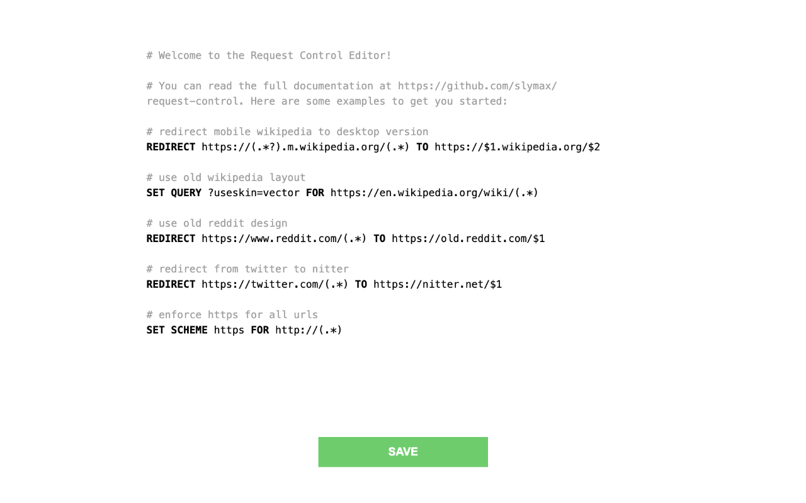

# Request Control

This browser extension allows you to define rules for modifying, blocking, and redirecting web requests using a simple syntax that is close to natural language. The extension leverages chrome's [`declarativeNetRequest`](https://developer.chrome.com/docs/extensions/reference/declarativeNetRequest) API for modifying network requests.



## Installation

https://chrome.google.com/webstore/detail/request-control/gkadogdmakibilhnklflcgaennojgipd

## Syntax

<table>
    <tr>
        <td>SET</td>
        <td><code>&lt;URL_COMPONENT&gt;</code></td>
        <td><code>VALUE &lt;STRING&gt;</code></td>
        <td>FOR</td>
        <td><code>URL &lt;REGEX&gt;</code></td>
    </tr>
    <tr>
        <td>REMOVE</td>
        <td><code>&lt;URL_COMPONENT&gt;</code></td>
        <td>FROM</td>
        <td><code>URL &lt;REGEX&gt;</code></td>
        <td>-</td>
    </tr>
    <tr>
        <td>REDIRECT</td>
        <td><code>URL &lt;REGEX&gt;</code></td>
        <td>TO</td>
        <td><code>URL &lt;REGEX&gt;</code></td>
        <td>-</td>
    </tr>
    <tr>
        <td>BLOCK</td>
        <td><code>URL &lt;REGEX&gt;</code></td>
        <td>-</td>
        <td>-</td>
        <td>-</td>
    </tr>
    <tr>
        <td>ALLOW</td>
        <td><code>URL &lt;REGEX&gt;</code></td>
        <td>-</td>
        <td>-</td>
        <td>-</td>
    </tr>
</table>

`<URL_COMPONENT>` can be `FRAGMENT`, `HOST`, `PASSWORD`, `PATH`, `PORT`, `QUERY`, `SCHEME`, or `USERNAME`.

### Examples

<table>
    <tr>
        <td>SET</td>
        <td>QUERY</td>
        <td><code>?&#8288;useskin=vector</code></td>
        <td>FOR</td>
        <td><code>https://en.wikipedia.org/wiki/(.*)</code></td>
    </tr>
    <tr>
        <td>REMOVE</td>
        <td>FRAGMENT</td>
        <td>FROM</td>
        <td><code>https://en.wikipedia.org/wiki/URL#Syntax</code></td>
        <td>-</td>
    </tr>
    <tr>
        <td>REDIRECT</td>
        <td><code>https://(.*?).m.wikipedia.org/(.*)</code></td>
        <td>TO</td>
        <td><code>https://$1.wikipedia.org/$2</code></td>
        <td>-</td>
    </tr>
    <tr>
        <td>BLOCK</td>
        <td><code>https://www.reddit.com</code></td>
        <td>-</td>
        <td>-</td>
        <td>-</td>
    </tr>
    <tr>
        <td>ALLOW</td>
        <td><code>https://www.reddit.com/r/popular</code></td>
        <td>-</td>
        <td>-</td>
        <td>-</td>
    </tr>
</table>

## FAQs

### Why are my redirects not working?

Some websites install service workers that intercept network requests before they can be processed by the browser. You can unregister service workers either via DevTools (Application > Service Workers) or by pasting the following code into the address bar of an affected website (you'll have to retype the `javascript:` part after pasting):

```
javascript:navigator.serviceWorker.getRegistrations().then(rs => { for (const r of rs) r.unregister() });
```

The extension automatically unregisters service workers when rules for popular websites are applied (see `config.js` for the full list of websites).

### Why is my regular expression not working? I'm getting an error that the `regexFilter` is invalid.

Chrome uses google's [re2](https://github.com/google/re2/wiki/Syntax) for evaluating regular expressions. Expressions containing lookarounds are not supported.

## Development

To grab the latest version of `monaco-editor`, run the following command:

```sh
wget -qO monaco.js https://esm.run/monaco-editor
```

## Roadmap

- [X] Automatically unregister service workers ([browsingData](https://developer.chrome.com/docs/extensions/reference/browsingData))
- [ ] Allow setting request headers ([ModifyHeaderInfo](https://developer.chrome.com/docs/extensions/reference/declarativeNetRequest/#type-ModifyHeaderInfo))
- [ ] Allow setting query parameters ([QueryTransform](https://developer.chrome.com/docs/extensions/reference/declarativeNetRequest/#type-QueryTransform))
- [ ] Add support for dark mode
